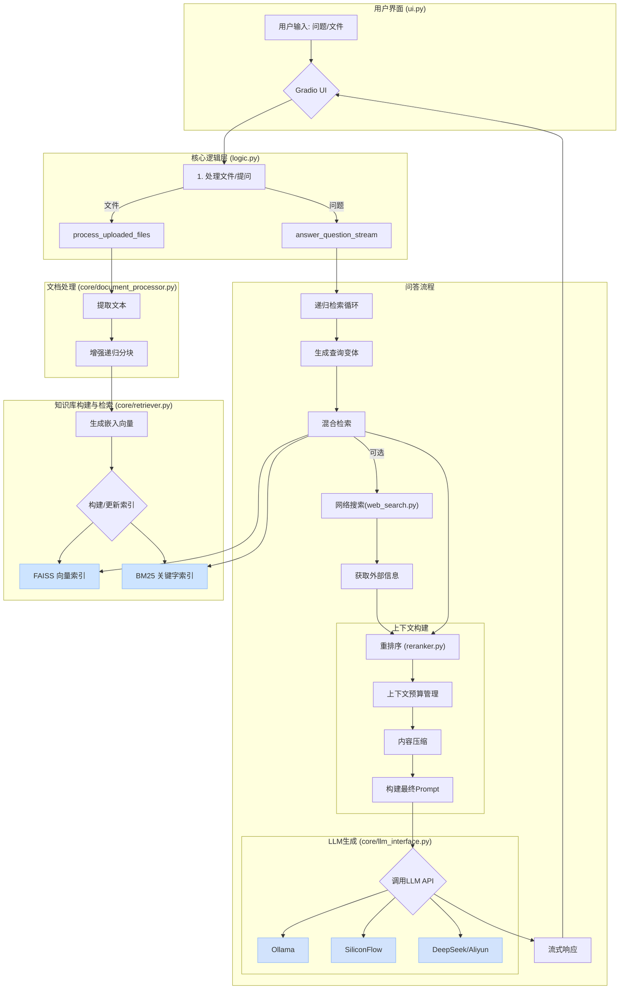

# 智能文档问答系统 (RAG Learning Project)

## ✨ 核心功能

- **多格式文件处理**: 支持处理多种主流文件格式，包括 PDF, Word, Excel, PowerPoint, Markdown, TXT, JSON, CSV, 和 HTML。
- **增强的文本分块策略**: 采用`RecursiveCharacterTextSplitter`，并实现了智能分隔符选择、语义边界保护和分块后处理等优化策略，以提升文本块的语义完整性。
- **混合检索**: 结合了基于向量的语义检索（FAISS）和基于关键字的稀疏检索（BM25），并通过加权融合（Hybrid Search）来提高检索召回率和相关性。
- **多模型重排序（Reranking）**: 支持使用`Cross-Encoder`模型或LLM对检索到的文档进行重排序，以提高最终上下文的质量。
- **上下文管理与压缩**: 实现了上下文窗口预算管理机制。当上下文超出预算时，会自动调用LLM对低相关性的文档进行摘要压缩，确保在不丢失关键信息的前提下，最大化利用上下文空间。
- **递归检索与查询转换**: 通过多轮迭代检索，并利用LLM生成查询变体（Query Transformation），逐步深化对用户问题的理解，从更广泛的视角挖掘相关信息。
- **多API适配与流式输出**: 无缝集成了多种LLM服务（本地Ollama, SiliconFlow, DeepSeek, 阿里云DashScope），并为所有兼容的服务实现了稳定的流式输出，提升了用户交互的实时体验。
- **集成网络搜索**: 支持启用网络搜索功能，当本地知识库信息不足时，可以从互联网获取实时信息作为补充。支持多种搜索引擎（DuckDuckGo, SerpAPI, Bing, Google CSE），并可自动切换。
- **模块化Gradio用户界面**:
    - **问答对话**: 核心的交互界面。
    - **分块可视化**: 用于检视文档被切分后的具体文本块，便于理解和调试RAG的检索内容。
    - **系统信息**: 实时展示系统配置、模型状态和知识库统计数据，提供了良好的可观测性。

## 🚀 项目架构

下图展示了从用户提问到系统响应的完整数据流和处理流程。



## 🛠️ 如何运行

1.  **克隆或下载项目**
    ```bash
    # 如果你有git
    git clone <repository_url>
    cd <repository_name>
    ```

2.  **创建虚拟环境并激活**
    ```bash
    python -m venv venv
    # Windows
    .\venv\Scripts\activate
    # macOS/Linux
    source venv/bin/activate
    ```

3.  **安装依赖**
    ```bash
    pip install -r requirements.txt
    ```

4.  **配置环境变量**
    - 复制或重命名 `.env.example` (如果存在) 为 `.env`。
    - 在 `.env` 文件中填入你的API密钥。项目会根据 `config.py` 自动加载这些密钥。
      ```env
      # SerpAPI (可选, 用于网络搜索)
      SERPAPI_KEY="your_serpapi_api_key"

      # SiliconFlow (可选, 用于云端LLM)
      SILICONFLOW_API_KEY="your_siliconflow_api_key"

      # DeepSeek (可选, 用于云端LLM)
      DEEPSEEK_API_KEY="your_deepseek_api_key"

      # 阿里云 DashScope (可选, 用于云端LLM)
      DASHSCOPE_API_KEY="your_dashscope_api_key"

      # Bing Search (可选, 用于网络搜索)
      BING_SEARCH_API_KEY="your_bing_search_api_key"

      # Google Custom Search Engine (可选, 用于网络搜索)
      GOOGLE_CSE_API_KEY="your_google_cse_api_key"
      GOOGLE_CSE_CX="your_google_cse_cx_id"
      ```

5.  **运行应用**
    ```bash
    python app.py
    ```
    应用启动后，会自动在浏览器中打开UI界面。

## ⚙️ 配置文件说明

项目的核心配置分为两部分，实现了**配置与密钥的分离**。

### `config_models.yaml`

这个文件负责管理模型名称、API端点、RAG参数等非敏感的、可共享的配置。

- **models**: 定义不同阶段使用的模型，如嵌入、重排序、生成模型。
- **chunking**: 设置文本分块的大小和重叠。
- **retrieval**: 配置检索参数，如混合检索的权重、返回的文档数量等。
- **endpoints**: 统一管理所有第三方服务的API地址。
- **search**: 配置网络搜索引擎、语言、国家等参数。
- **api**: 为不同的LLM API设置默认的调用参数，如温度、最大token等。
- **app**: 应用相关的配置，如端口范围。

### `.env`

这个文件用于存放**敏感信息**，如API密钥。它不应该被提交到版本控制中。`config.py` 会在启动时自动加载此文件中的环境变量。

## 📂 文件结构

```
.
├── app.py                  # 应用主入口，负责启动和协调
├── config.py               # 配置加载模块，从.yaml和.env读取配置
├── config_models.yaml      # 模型和系统参数配置文件
├── logic.py                # 核心业务逻辑，连接UI和后端核心功能
├── requirements.txt        # Python依赖列表
├── ui.py                   # Gradio界面定义和事件处理
├── core/                   # 核心功能模块目录
│   ├── document_processor.py # 文件解析与文本分块
│   ├── llm_interface.py    # 封装对不同LLM API的调用
│   ├── reranker.py         # 重排序逻辑
│   ├── retriever.py        # 检索逻辑 (FAISS & BM25)
│   └── web_search.py       # 网络搜索逻辑
└── utils/                  # 辅助工具模块目录
    └── helpers.py          # 辅助函数，如环境检查、端口检查等
```

